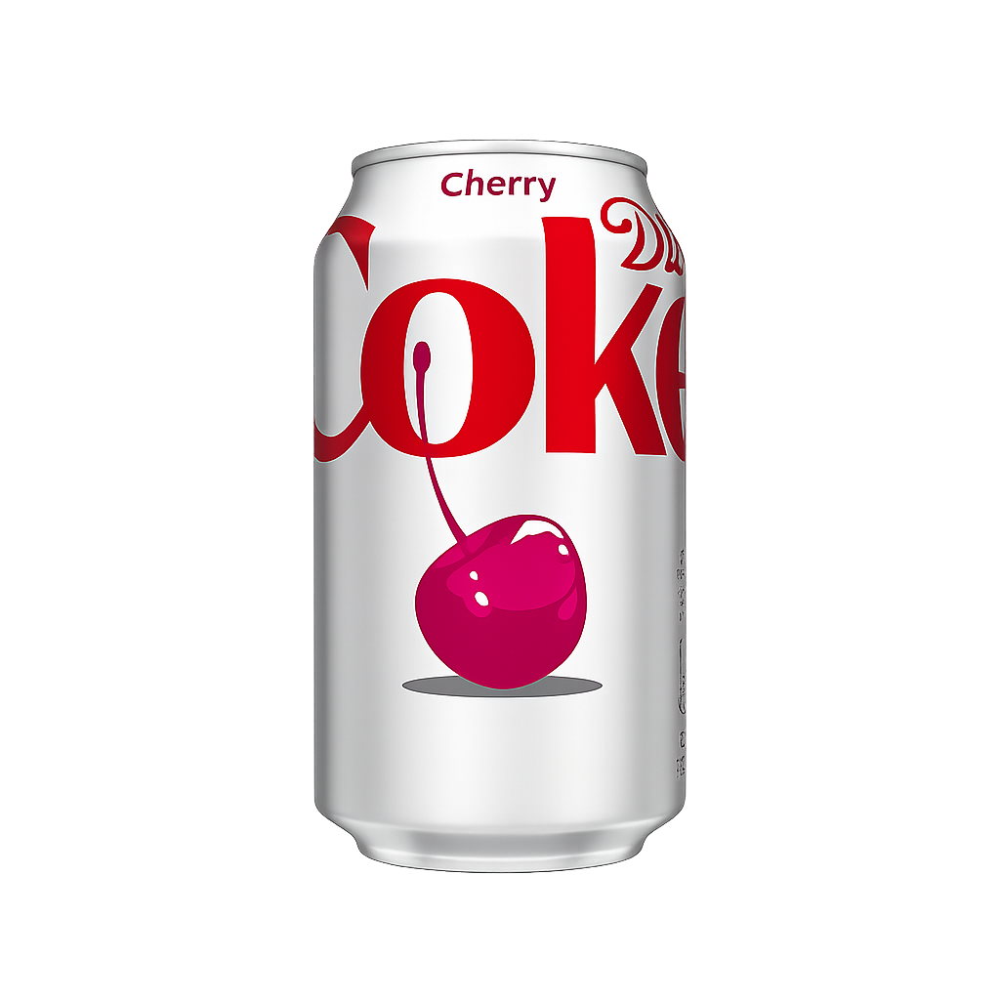
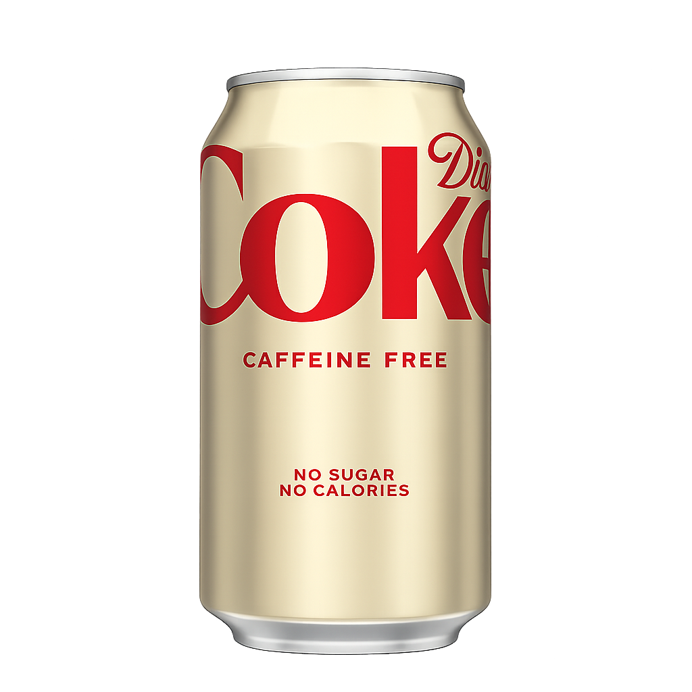

# DIET COKE — SIGNATURE EXPERIENCE

> I was trying something new. I thought, let's experiment on Diet Coke. I hope it worked.

---

<div align="center">


**NO SUGAR. NO CALORIES. NO COMPROMISES.**

</div>

---

## The Premise

This was never supposed to be a portfolio project. There was no brief, no client, no deadline. Just a thought — what happens when you treat a soda can like a luxury product, and build a digital experience around it like your life depends on it?

This is that answer.

A fully scroll-driven, canvas-powered, frame-by-frame animated web experience built around one of the most iconic beverages on the planet. Not because it needed one. Because it deserved one.

---

## The Visual Language

The palette was non-negotiable from the first line of code.

| Token | Value | Role |
|---|---|---|
| Obsidian | `#000000` | Absolute ground. The void. |
| Intense Red | `#E41E2A` | The only color that matters. |
| Silver | `#C6C6C6` | The sheen on cold metal. |
| Gold | `#D4AF37` | Reserved. Rare. For the Caffeine Free. |

Typography is a duality. **Anton** at display scale — loud, unapologetic, the kind of type that fills a room. **Space Mono** for the archive labels — technical, cold, precise. **Hanken Grotesk** for the body — clean enough to not get in the way.

---

## The Variants

Three cans. Three identities. One section to rule them all.

---

### VARIANT 01 — THE ORIGINAL CLASSIC

<div align="center">


</div>

The one that started everything. A formulation so precise it has barely changed in over four decades. The Classic is the reference point. Everything else is measured against it.

On the web experience, the Classic sits front and center. Always. It does not move from its throne. The world fans out around it.

---

### VARIANT 02 — CHERRY

<div align="center">



</div>

This one has personality. Hover over it and the entire environment bleeds crimson — a deep, dark red aura that pulses outward like the can itself is breathing. The Cherry variant does not ask for attention. It commands it.

In the fan-out animation, it rotates and retreats to the left, still imposing, still present, tilted at just the right angle to feel dangerous.

---

### VARIANT 03 — CAFFEINE FREE

<div align="center">



</div>

The subtle one. Gold. Muted. Almost restrained — until you look closely. Hover over it and the whole background warms to a faint, luxurious amber. It does not scream. It glows.

The Caffeine Free is for people who know what they want and do not need the stimulant to prove it.

---

## The Partnership Section

<div align="center">


</div>

> "Don't be ridiculous. Everybody wants this."

A collaboration section built around the cultural collision of Diet Coke and The Devil Wears Prada 2. The white section slams into the obsidian world like a physical object. Typography at 8vw. A poster that slides in from the right. A coke can that climbs up to overlap it like it owns the room.

Because it does.

---

## The Technical Architecture

This experience does not use a single video file. Every frame of the scroll animation is a hand-processed image, loaded in sequence and painted frame-by-frame onto an HTML5 Canvas element — a technique borrowed from the most visually demanding product pages in the world.

### Scroll-Driven Canvas Animation

```
Total Frames (First Animation)  — 240 frames
Total Frames (Second Animation) — 300 frames
Scroll Coverage (First)         — 300vh of pure frame scrubbing
Scroll Coverage (Second)        — 300vh independent section scrub
Frame Rendering                 — HTML5 Canvas 2D context
Smoothing Engine                — Lenis v1 (Studio Freight)
```

The frames are preloaded into memory on page initialization. As the user scrolls, the scroll position is mapped directly to a frame index. The result is a video that is entirely controlled by the user's hand — pause at any frame, scrub forward, scrub back. Total control.

### The Animation Stack

| Layer | Technique | Purpose |
|---|---|---|
| Hero Canvas | Frame scrubbing (240 frames) | Cinematic product reveal |
| Manifesto Canvas | Frame scrubbing (300 frames) | Second act visual drive |
| Flavors Fan-Out | CSS transforms via JS | Three-can spread with depth |
| Prada Section | Scroll parallax | Dual-panel cultural moment |
| FAQ Section | Mouse parallax | Floating cans in background |
| Hover Auras | Inline radial gradients | Per-variant color theming |

### The Hover Interaction System

When the cans fan out in the Flavors section, each individual can becomes an interactive object. Hovering over any can triggers a dynamic background shift — a radial gradient that pulses outward from the center of the screen, tinted to that variant's specific identity color.

```
Cherry can hover    → rgba(228, 30, 42, 0.4) — deep crimson radial pulse
Caffeine Free hover → rgba(212, 175, 55, 0.3) — warm gold radial pulse  
Classic hover       → rgba(255, 255, 255, 0.2) — cold silver radial pulse
```

All transitions run at `700ms ease` for a deliberate, unhurried feel.

---

## The Page Structure

```
SECTION 01  — Hero (fixed canvas + scroll-driven title and info text)
SECTION 02  — Manifesto (second canvas + typography overlay)
SECTION 03  — Flavors Fan-Out (three-can interactive spread)
SECTION 04  — The Standard (editorial lifestyle grid)
SECTION 05  — Devil Wears Prada Partnership (full-bleed white section)
SECTION 06  — FAQ (floating background cans with mouse parallax)
FOOTER      — Minimal. Credited.
```

---

## The Stack

```
Core          — HTML5, Vanilla CSS, Vanilla JavaScript (ESM)
Build Tool    — Vite
CSS Framework — Tailwind CSS v3 (CDN)
Scroll Engine — @studio-freight/lenis
Fonts         — Anton, Hanken Grotesk, Space Mono (Google Fonts)
Animation     — requestAnimationFrame, HTML5 Canvas 2D
Deployment    — Static
```

---

## Running The Experience

```bash
# Install dependencies
npm install

# Start the development server
npm run dev

# Build for production
npm run build
```

The development server runs on `localhost:5173` by default via Vite. Frame assets must be present in `public/frames/` and `public/second-frames/` for the canvas animations to render.

---

## File Structure

```
scroll-animation/
├── public/
│   ├── frames/              (240 animation frames — first sequence)
│   ├── second-frames/       (300 animation frames — second sequence)
│   └── flavors/             (product renders — Classic, Cherry, Caffeine Free, Prada)
├── src/
│   ├── main.js              (core animation loop, scroll logic, hover interactions)
│   └── style.css            (global styles, text-outline utility)
├── index.html               (full page structure)
└── README.md                (you are here)
```

---

## Design Principles

**Reject the mundane.** If a design decision can be made safely, it is probably the wrong one. Every choice in this project exists because it was the most extreme version of that choice.

**Earn the scroll.** Every pixel of scrollable height has a purpose. Nothing is padding. Nothing is filler. The user gives you their time and you give them a reason to keep going.

**The can is the hero.** The typography exists to serve the can. The animation exists to serve the can. The entire page exists to put a Diet Coke in front of someone and make them feel something about an aluminum cylinder they could buy for a dollar at a gas station.

That is the experiment. That is the point. That is Diet Coke.

---

## Credits

Built entirely by **Daksh Ranjan Srivastava**

`dakshshrivastav56@gmail.com`

---

*No sugar. No calories. No shortcuts.*
